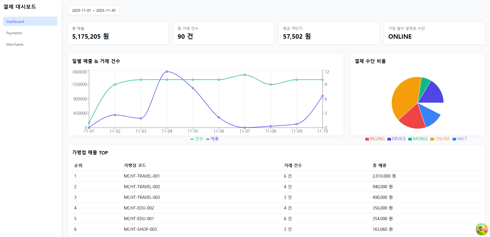

# 🧾 Pays Dashboard — 결제/가맹점 시각화 대시보드

React + TypeScript + Vite + TailwindCSS + React Query 기반으로 제작된  
결제/가맹점 데이터 시각화 대시보드 웹 애플리케이션입니다.

<p align="center">

</p>

---

## 🚀 프로젝트 개요

본 프로젝트는 채용 과제를 위해 제공된 오픈 API를 활용하여  
결제/가맹점 데이터를 조회하고 시각화한 **대시보드 UI** 를 구현한 프로젝트입니다.

### ✨ 주요 기능

- 📊 **대시보드**
  - 총 매출 / 총 거래건수 / 평균 객단가 / 가장 많이 결제된 수단
  - 일별 매출 Line Chart
  - 결제 수단 비율 Pie Chart
  - 가맹점별 매출 Top5 테이블

- 💳 **거래 내역 페이지**
  - 검색, 정렬, 필터(상태/결제수단)
  - 상태별 뱃지 스타일링
  - 시간 정렬 토글 기능

- 🏪 **가맹점 목록 페이지**
  - 검색, 정렬(등록일), 상태/업종 필터
  - 가맹점 클릭 시 상세 페이지 이동

- 🏪➡️💳 **가맹점 상세 페이지**
  - 기본 정보 표시
  - 해당 가맹점의 거래 내역 매핑(프론트 필터링 기반)

---

## 🎨 디자인 의도 및 UI/UX 포인트

본 프로젝트는 별도의 템플릿 없이 **직접 UI/UX를 설계하여 구현**했습니다.

- **정보 우선순위**에 따라 상단(요약) → 그래프(추세) → 표(상세) 구조
- 대시보드 특성에 맞게 **가독성 높은 숫자 강조 스타일** 적용
- TailwindCSS로 일관된 색상, 간격, 레이아웃 유지
- 검색/정렬/필터 기능을 강화하여 **데이터 탐색 중심 UX** 제공

---

## 🏗 기술 스택

| 영역 | 기술 |
|------|------|
| 프레임워크 | React 18+, TypeScript |
| 번들러 | Vite |
| 상태 관리 | React Query |
| 스타일 | Tailwind CSS |
| 차트 | Recharts |
| HTTP Client | Axios |
| 날짜 처리 | date-fns |

---

## 🔐 환경 변수 (.env) 설정

### 📄 `.env` 파일
프로젝트 루트에 아래와 같이 생성해 주세요:

`VITE_API_BASE_URL=https://recruit.paysbypays.com/api/v1`

---

## 📁 폴더 구조

```bash
src/
 ├─ components/        # 공통 UI 컴포넌트
 ├─ hooks/             # React Query 기반 커스텀 훅
 ├─ layouts/           # 대시보드 레이아웃
 ├─ lib/               # Axios apiClient
 ├─ pages/             # 페이지 단위 구성
 ├─ routes/            # 라우터 설정
 ├─ services/          # API 요청 모음
 ├─ types/             # API 타입 정의
 ├─ utils/             # 통계 계산, 날짜 유틸
```

### **사용한 엔드포인트**
- `/payments/list`
- `/merchants/list`
- `/merchants/details`
- `/merchants/details/{mchtCode}`
- `/common/payment-status/all`
- `/common/payment-type/all`
- `/common/mcht-status/all`

---

## 📊 데이터 계산 방법

API가 제공하지 않는 데이터(예: 매출 합계, 일별 매출, 결제 수단 분포 등)는  
프론트엔드에서 직접 계산하여 UI에 표시했습니다.

### 1. 총 매출 / 총 건수 / 평균 객단가**
```ts
const totalAmount = sum(payments.amount);
const totalCount = payments.length;
const avgAmount = totalAmount / totalCount;
```

### 2. 일별 매출 통계 (LineChart)
```ts

```

### 3. 결제수단 비율 (PieChart)
```ts

```

### 4. 가맹점 매출 Top10

---

## 🖥 실행 방법

```bash
npm install
npm run dev
```

node 버전 v20.19.6

🏠 대시보드 화면
<!-- IMAGE_DASHBOARD -->
💳 거래 내역 페이지
<!-- IMAGE_PAYMENTS -->
🏪 가맹점 목록 페이지
<!-- IMAGE_MERCHANT_LIST -->
🏪 가맹점 상세 페이지
<!-- IMAGE_MERCHANT_DETAIL -->
📈 차트 (Line / Pie)
<!-- IMAGE_CHARTS -->

## 🙌 마무리

본 프로젝트는 제공된 API 기반으로 실제 서비스 대시보드 구조에 맞게 설계·구성하였습니다.
프론트엔드에서 수행 가능한 통계 계산 및 시각화를 구현하여
데이터 기반의 인터페이스를 구현하는 데 집중했습니다.

감사합니다 😊
